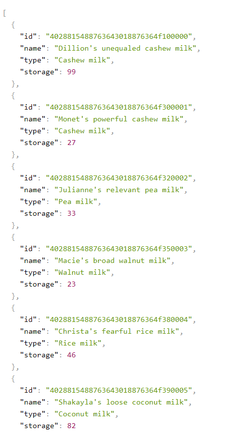

# Milk Products Backend

### Application Purpose
The project is a full-stack team management application. The backend connects to a remote database and provides an API that can be used to edit storage in the database.

### Json DATA

 

### Technology

The backend was built in Java using Maven and Spring Boot, then deployed through Azure, and the database was made with PostgreSQL.